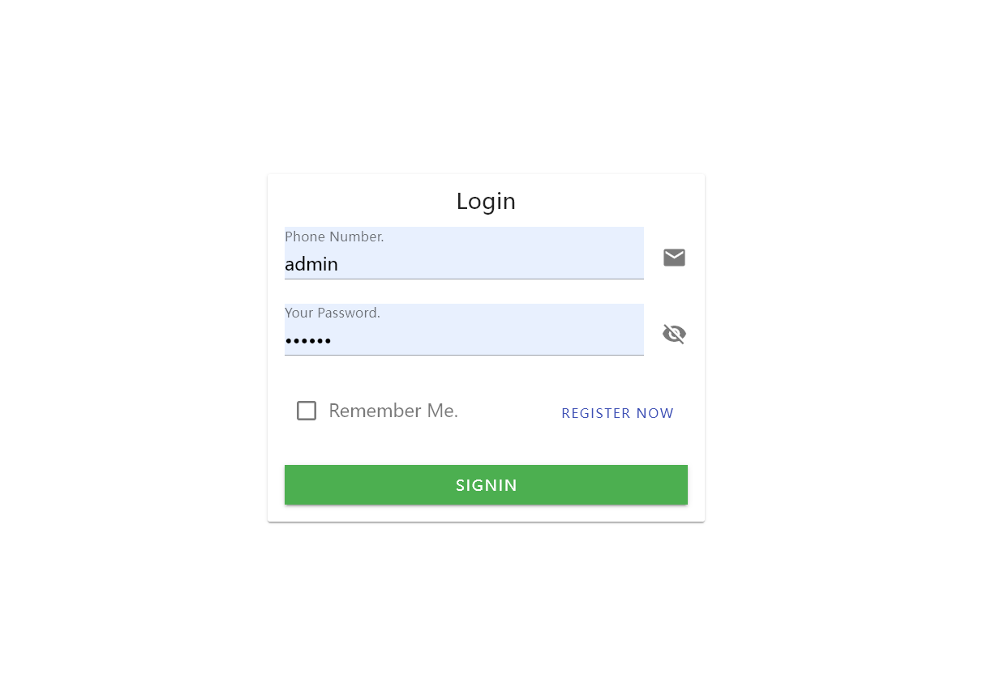
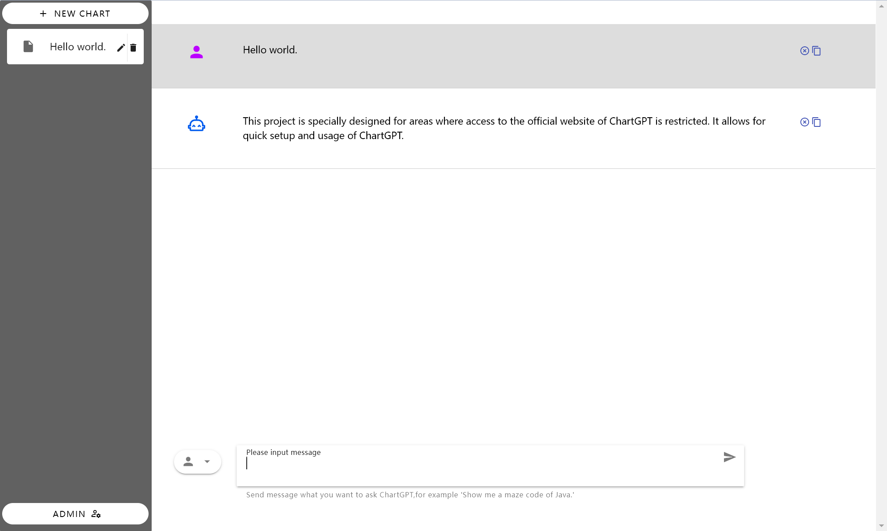

# Simple ChartGPT

## Introduction

Simple ChartGPT is a ChartGPT API application that allows you to quickly build your own ChartGPT.Specially for areas where access to the official website of ChartGPT is restricted. It allows for quick setup and usage of ChartGPT.

## Deployment

To deploy the application, please follow the steps below:

1. Navigate to the project directory and run the `start.sh` script and follow the prompts to enter the required information. The system will automatically package the code and start the application:

```shell
bash ./start.sh
```

2. Access the application by using the provided URL or IP address.

3. The default username is `admin` and the default password is `000000`.


## Uninstallation

To uninstall the application, please follow the steps below:

1. Navigate to the project directory and run the `stop.sh` script. The system will automatically clean and uninstall all the applications. Please note that Docker engine and plugins will not be uninstalled:

```shell
bash ./stop.sh
```

## License

This project is licensed under the [MIT License](LICENSE).
