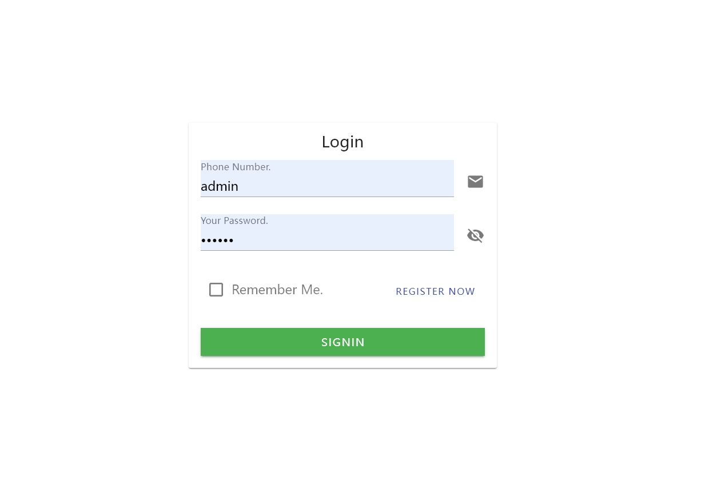

# Simple ChartGPT
[English](README.md)
## 简介

Simple ChartGPT 是一个基于 ChartGPT API 的应用，让你快速构建自己的 ChartGPT，特别适用于无法访问 ChartGPT 官方网站的地区。它可以快速搭建和使用 ChartGPT。

## 部署

要部署该应用程序，请按照以下步骤进行操作：

1. 进入项目目录，并运行 `start.sh` 脚本，按照提示输入所需信息。系统将自动打包代码并启动应用程序：

```shell
bash ./start.sh
```

2. 使用提供的 URL 或 IP 地址访问应用程序。

3. 默认用户名为 `admin`，默认密码为 `000000`。



## 卸载

要卸载该应用程序，请按照以下步骤进行操作：

1. 进入项目目录，并运行 `stop.sh` 脚本。系统将自动清理和卸载所有应用程序。请注意，Docker 引擎和插件不会被卸载：

```shell
bash ./stop.sh
```

## 许可证

该项目使用 [MIT 许可证](LICENSE) 进行许可。
